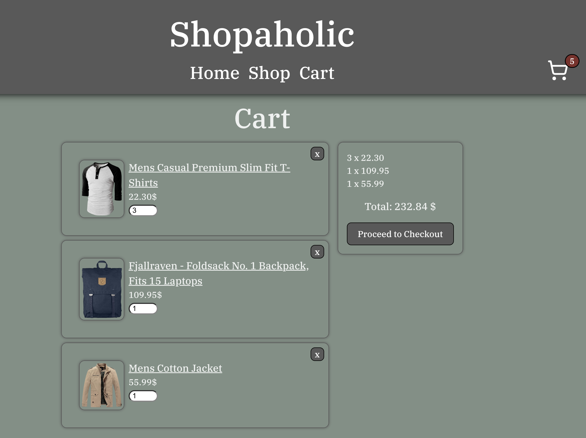

# Shopping Cart
This is a small shopping cart project in which I exercise react concepts such: as routing, testing, css-modules and Context.

It has basic functionality like adding to cart, seeing how many items are in the cart throughout the page, and being a Single Page App.

[See it for yourself!]()

### [Try it out!](https://shopping-cart-delta-coral.vercel.app/cart)

